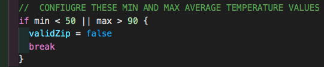
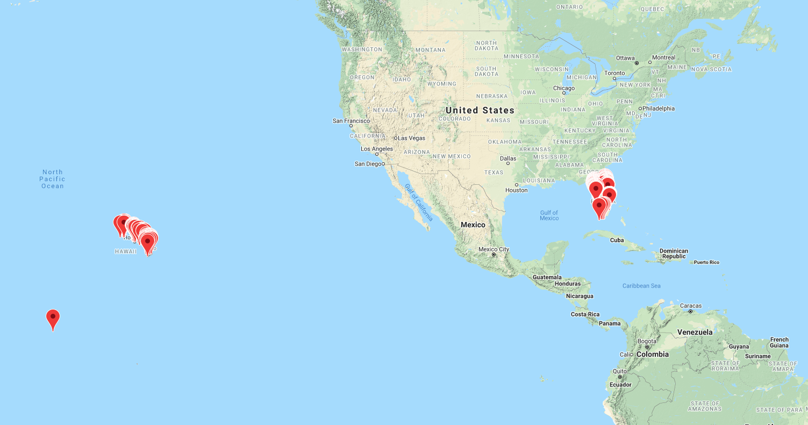

# Weather Averages By Zipcode

This is a tool that allows you to search the United States for zipcodes that match a weather criteria. The zips
are then displayed in a google map. All weather data and zipcode data has been already downloaded and is in this repo (inside the `data` directory).

1. Configure the values for the max and min average in `getZipCodes.go` (If you are clever you can even tweak to use the `prec` values to factor in precipitation)

2. Execute `go run getZipCodes.go` which will populate the `sample.js` file.
3. Open in your browser the `map.html` to display the plotted zipcodes that match your weather criteria.

